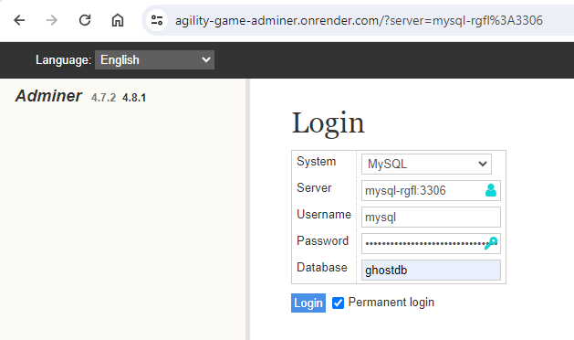

# Adminer on Render

This is an example repo with a Dockerfile for running [Adminer](https://www.adminer.org/) as a **web service** on Render.

Adminer is a full-featured web-based database management tool for MySQL, MariaDB, PostgreSQL, SQLite, Elasticsearch, MongoDB and more.

You can use it to easily manage your [MySQL](https://render.com/docs/deploy-mysql), [PostgreSQL](https://render.com/docs/databases) and [Elasticsearch](https://render.com/docs/deploy-elasticsearch) instances running on Render.

## Deployment
See https://render.com/docs/deploy-adminer.

We can connect to our MySQL Instance for Ghost as follows (from https://agility-game-adminer.onrender.com/):

**NOTE**: The password is to be found as one of the ENVIRONMENT VARIABLES (here: MYSQL_ROOT_PASSWORD) of the MySQL instance, see the [Dashboard](https://dashboard.render.com/pserv/srv-cmufn36v3ddc738hqp0g/env) on Render.com. 
